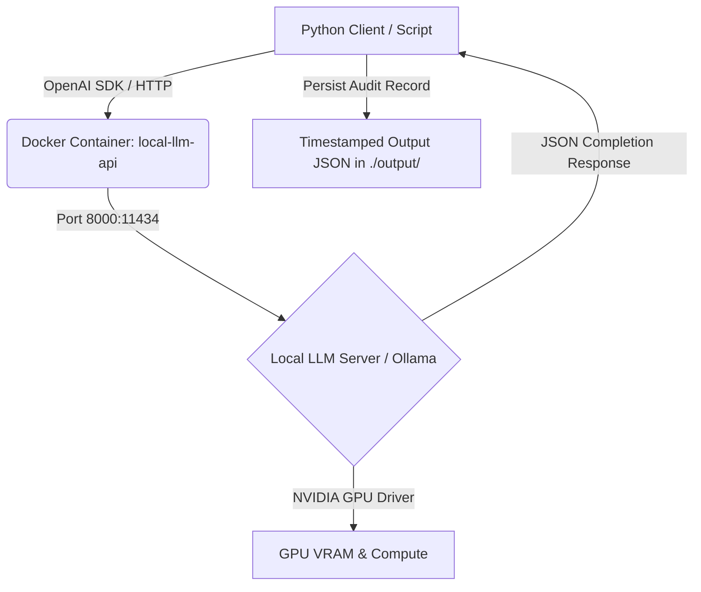

# OpenAI-Compatible Local Inference API Project

A self-hosted, GPU-accelerated local LLM inference pipeline using Docker and an **OpenAI-compatible API**, paired with a production-grade Python client suite for text summarization, language translation (English <-> Thai), and schema-driven structured data extraction.

---

## 🏗 Architecture & Workflow



---

## 📁 Project Structure

```text
openai_inference_api_project/
├── app/
│   ├── client.py            # Python OpenAI SDK client (Summarization, Translation, Extraction)
<<<<<<< HEAD
│   └── docker-compose.yml   # Container orchestration for GPU-accelerated local LLM (Port 8000)
├── .env.example             # Environment variable template
├── .gitignore               # Git ignore rules for virtualenvs, outputs, and model caches
=======
│
├── .env           # Environment configuration template
└── docker-compose.yml   # Container orchestration for GPU-accelerated local LLM
├── .gitignore               # Git ignore rules for virtual environments, outputs, and caches
>>>>>>> 14ae0633ea57e213c9e5beb5215d0a9f023cfae0
├── requirements.txt         # Python package dependencies (openai>=1.40.0)
└── README.md                # Project documentation
```

---

## ⚡ Key Features

- **OpenAI-Compatible REST API**: Self-hosted local LLM endpoint running on port `8000/v1`.
- **NVIDIA GPU Acceleration**: Docker passthrough reserved for full GPU VRAM offloading and fast throughput.
- **Python Client Suite ([client.py](file:///c:/Users/neonp/Desktop/neon_project/openai_inference_api_project/app/client.py))**:
  - 📝 **Text Summarization**: Converts unstructured text into factual, concise bullet points.
  - 🌐 **Language Translation**: Accurate English <-> Thai translation preserving tone and context.
  - 📊 **Structured Data Extraction**: Returns strictly typed JSON objects conforming to target JSON schemas.
- **Production Resilience**: Includes custom request timeout handling, linear retry backoff, and non-blocking error handling.
- **Audit Logs**: Automatically saves all client requests and responses as timestamped JSON files in `./output/`.

---

## 🚀 Quickstart Guide

### 1. Prerequisites

- **Docker Desktop** (with WSL2 backend on Windows) or **Docker Engine** (on Linux).
- NVIDIA GPU with up-to-date graphics drivers.
- Confirm Docker can access your GPU:
  ```powershell
  docker run --rm --gpus all nvidia/cuda:12.4.1-base-ubuntu22.04 nvidia-smi
  ```

> [!NOTE]
> If your GPU is recognized in the `nvidia-smi` output, Docker is configured correctly for local LLM acceleration.

---

### 2. Environment Configuration

Copy the template configuration file to create your local environment file:

```bash
cp env.example .env
```

| Variable | Description | Default Value |
| :--- | :--- | :--- |
| `MODEL_NAME` | Model ID to serve / request | `Qwen/Qwen2.5-7B-Instruct` |
| `HF_TOKEN` | Hugging Face access token (for gated models like Llama-3) | `""` |
| `HF_CACHE_DIR` | Local directory for cached model weights | `./hf_cache` |

---

### 3. Launch the Server

Navigate to the `app/` folder and start the service in detached mode:

```bash
cd app
docker compose up -d
```

Check service status and container health:

```bash
docker compose ps
```

Pull your desired model weights into the local container (e.g., `qwen2.5:7b-instruct` or `qwen2.5:3b`):

```bash
docker exec -it local-llm-api ollama pull qwen2.5:7b-instruct
```

Verify service tags and availability:

```bash
curl http://localhost:8000/api/tags
```

---

### 4. Set Up Python Client & Run Demo

From the project root directory:

```powershell
# Create and activate virtual environment
python -m venv venv

# Windows PowerShell:
.\venv\Scripts\Activate.ps1

# Linux / macOS:
# source venv/bin/activate

# Install requirements
pip install -r requirements.txt

# Execute client test suite
python app/client.py
```

---

## 💻 Direct API Usage Examples

### Raw HTTP Request (cURL)

You can call the OpenAI-compatible endpoint using standard `curl` or any HTTP client:

```bash
curl http://localhost:8000/v1/chat/completions \
  -H "Content-Type: application/json" \
  -d '{
    "model": "qwen2.5:7b-instruct",
    "messages": [
      {"role": "system", "content": "You are a helpful assistant."},
      {"role": "user", "content": "Explain vector embeddings in two simple sentences."}
    ],
    "temperature": 0.3
  }'
```

---

### Python Code Integration

Import client functions directly from [client.py](file:///c:/Users/neonp/Desktop/neon_project/openai_inference_api_project/app/client.py):

```python
from app.client import summarize_text, translate_text, extract_structured_data

# 1. Summarization
res_summary = summarize_text("Long text snippet here...", bullet_points=5)
if res_summary.ok:
    print(res_summary.data)

# 2. Translation (English -> Thai)
res_translation = translate_text("Artificial intelligence is transforming industries.", target_lang="th")
if res_translation.ok:
    print(res_translation.data)

# 3. Structured Data Extraction
sample_text = "Customer reported an issue with order #12345. Resolution was provided promptly."
res_extraction = extract_structured_data(sample_text)
if res_extraction.ok:
    print(res_extraction.data)  # Returns dictionary matching JSON Schema
```

---

### Output JSON Log Format

Each request automatically generates a timestamped log file in `./output/` structured as:

```json
{
  "ok": true,
  "task": "summarization",
  "data": "- Bullet point 1\n- Bullet point 2\n- Bullet point 3",
  "error": null,
  "model": "qwen2.5:7b-instruct",
  "duration_s": 1.42,
  "meta": {
    "attempt": 1,
    "finish_reason": "stop"
  }
}
```

---

## ⚙ Client Environment Configuration

Customize client behavior via environment variables:

| Variable | Description | Default |
| :--- | :--- | :--- |
| `LLM_API_BASE_URL` | Base URL of OpenAI-compatible API | `http://localhost:8000/v1` |
| `LLM_MODEL_NAME` | Model ID sent in request payloads | `qwen2.5:7b-instruct` |
| `LLM_TIMEOUT_S` | Per-request timeout limit (seconds) | `120` |
| `LLM_MAX_RETRIES` | Max retry attempts on network error | `3` |
| `LLM_RETRY_BACKOFF_S` | Base retry backoff delay (seconds) | `2` |
| `LLM_OUTPUT_DIR` | Output JSON directory | `./output` |

---

## 📊 Recommended Models & Hardware Requirements

| Model ID | VRAM Requirement | Best Use Case |
| :--- | :--- | :--- |
| `qwen2.5:3b` | ~4–6 GB VRAM | Fast testing, lightweight summarization |
| `qwen2.5:7b-instruct` | ~8–12 GB VRAM | High-accuracy translation, structured JSON extraction |
| `llama3.1:8b` | ~10–14 GB VRAM | Complex reasoning and multi-turn conversations |
| `mistral:7b` | ~8–10 GB VRAM | General purpose instruction following |

---

## 🛠 Troubleshooting

> [!WARNING]
> **`APIConnectionError`**: Make sure the Docker container is running (`docker compose ps` inside `app/`) and port `8000` is open.

> [!TIP]
> **Model Loading Latency**: The very first request after pulling a model or starting the container will take a few extra seconds while the weights are being loaded into GPU memory.
